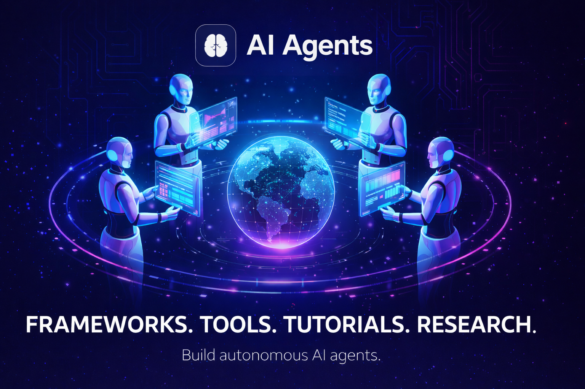

# 🤖 Learn AI Agents

> Build, learn and explore the world of **Autonomous AI Agents**

A modern, responsive landing & blog website focused on AI agents, frameworks, tools, tutorials and research.

🌐 **Live Site:** https://learnaiagents.live/

---

## ✨ Preview

---

## 🚀 About The Project

**Learn AI Agents** is a futuristic front-end project built to showcase modern UI/UX, responsive layouts and real-world landing page design.

This website acts as a hub where developers can:

- Learn AI Agent fundamentals  
- Explore frameworks & tools  
- Read tutorials and research  
- Discover real-world use cases  
- Stay updated with AI trends  

---

## 🧠 Website Sections

✔ Hero section with futuristic AI illustration  
✔ Frameworks (LangChain, CrewAI, AutoGen, Assistants)  
✔ Real-world AI Agent use cases  
✔ Step-by-step tutorials  
✔ Tools & resources  
✔ Research & trends  
✔ Blog + article pages  
✔ Newsletter & contact footer  
✔ Fully responsive mobile navigation  

---

## 🎨 UI Features

- Sticky glass-style navbar  
- Smooth scrolling navigation  
- Dark futuristic theme  
- SEO optimized meta tags  
- Open Graph social preview  
- Mobile responsive layout  
- Modern SaaS-style design  

---

## 🛠️ Built With

- **HTML5**
- **Tailwind CSS**
- **JavaScript**
- **Font Awesome**
- **Google Fonts**

---

## 🌍 Deployment

The website is deployed using modern static hosting.

### 🔹 Live URL
https://learnaiagents.live

### 🔹 Hosting Options
- Vercel  
- Netlify  
- GitHub Pages  

---

## 🎯 Purpose of This Project

This project was created to:

- Practice Tailwind CSS & responsive UI  
- Build a strong front-end portfolio project  
- Showcase real landing page design skills  
- Explore AI-focused product UI  

---

## 👨‍💻 Author

**Mohamed Akees**

- GitHub → https://github.com/MMMAkees  
- LinkedIn → https://www.linkedin.com/in/mohamed-akees/  
- Dev.to → https://dev.to/mmmakees  

---

## ⭐ Support

If you like this project, please give it a ⭐ on GitHub!
